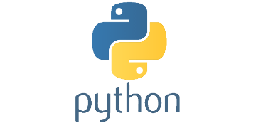

# Python ofensivo

    

## Índice principal

- [Introducción a Python](Introducción_a_Python.md)
- [Conceptos básicos de Python](Conceptos_básicos_de_Python.md)
- [Colecciones y estructuras de datos en Python](Colecciones_y_estructuras_de_datos_en_Python.md)
- [Programación Orientada a Objetos en Python (POO)](Programación_Orientada_a_Objetos_en_Python_(POO).md)
- [Módulos y paquetes en Python](Módulos_y_paquetes_en_Python.md)
- [Entrada y salida de datos](Entrada_y_salida_de_datos.md)
- [Proyectos de POO](Proyectos_de_POO.md)
- [Biblioteca estándar y herramientas adicionales](Biblioteca_estándar_y_herramientas_adicionales.md)

## Enlace al curso

- [Python ofensivo](https://hack4u.io/cursos/python-ofensivo/)
