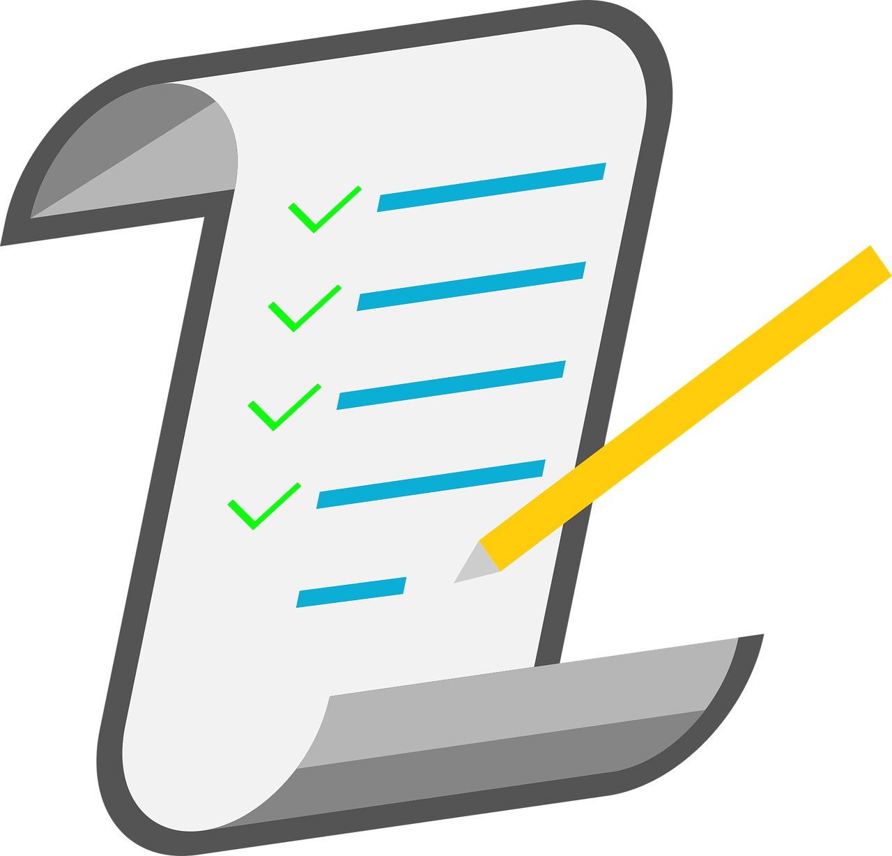

# Apuntes de cursos

    

Este repositorio incluirá apuntes personales de diversos cursos, todos tomados en Obsidian, por lo que para visualizarlos correctamente, se tendrá que utilizar la aplicación de [Obsidian](https://obsidian.md/download).

## Notas de cursos

- [Python ofensivo](Python_ofensivo/Indice.md)
- [Personalización de entorno en Linux](Personalizacion_entorno/)
- [Introducción al hacking](Hacking_introuction)
- [Instalación de Python2 en Debian](Python2_Install)
